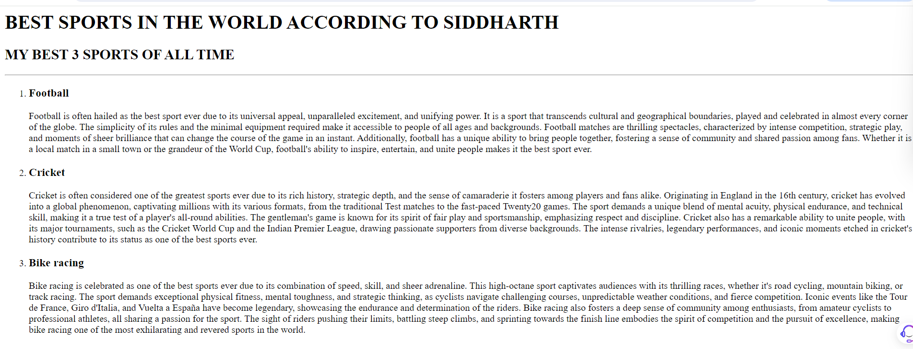
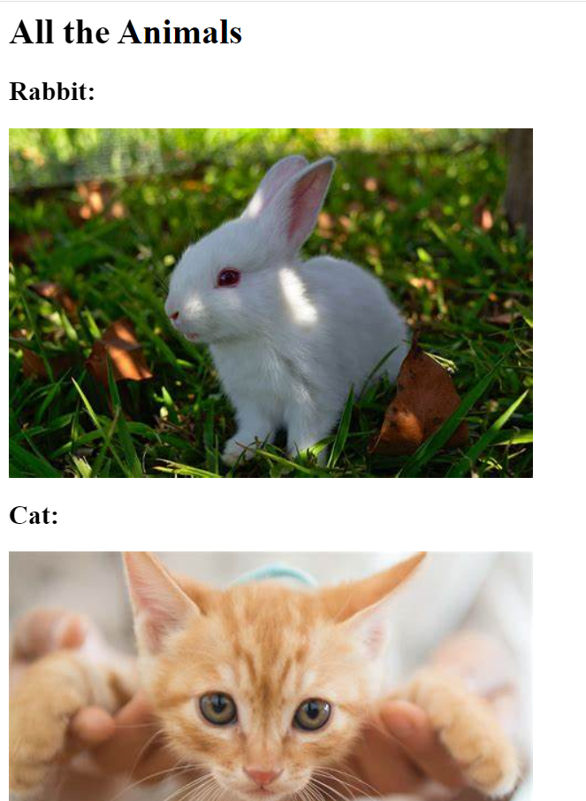

# Siddharth's Portfolio

## About Me
I am a passionate web development enthusiast, dedicated to building my skills and knowledge in this dynamic field. Currently, I am honing my expertise in web development while leveraging my strong communication skills to collaborate effectively with peers and mentors. As a fresh graduate passing out in 2025, I am eager to apply my academic learnings to real-world projects and contribute meaningfully to the tech community.

My technical proficiency includes programming languages such as C++, and I have a solid foundation in AWS Cloud and Cloud Security. I am committed to continuous learning and staying updated with the latest industry trends to deliver innovative and secure web solutions. My dedication and drive make me a motivated individual, ready to take on challenges and thrive in the ever-evolving landscape of web development.

Beyond my technical skills, I enjoy playing football, which keeps me active and instills a sense of teamwork and strategy. I am also a good leader and an adept problem solver, qualities that enable me to navigate challenges efficiently and inspire those around me. My diverse interests and skills combine to make me a well-rounded individual, poised to make a significant impact in the field of web development.

## Education
- **10th Grade (2017-2018):**
  - Achieved an impressive score of 84%.
- **12th Grade (2019-2020):**
  - Secured a solid 60%.
- **Bachelor of Technology (B.Tech) in Computer Science and Engineering (2021-2025):**
  - Currently pursuing with a commendable CGPA of 7.

## Skills

### Technical Skills
- **Programming Languages:**
  - C++
  - HTML
  - JavaScript
- **Web Development:**
  - Front-end Development (HTML, CSS, JavaScript)
  - Responsive Design
  - Frameworks/Libraries (e.g., React, Angular, Vue.js)
- **Cloud Technologies:**
  - AWS Cloud (Amazon Web Services)
  - Cloud Security
- **Tools and Platforms:**
  - Version Control (e.g., Git, GitHub)
  - Integrated Development Environments (IDEs) like Visual Studio Code
- **Other Technologies:**
  - Basic knowledge of databases (SQL, NoSQL)
  - Familiarity with REST APIs

### Soft Skills
- Communication: Effective verbal and written communication skills
- Problem Solving: Ability to identify and resolve issues efficiently
- Experience working collaboratively in teams
- Leadership: Proven leadership abilities and team management skills

### Additional Skills
- Project Management: Experience managing and executing projects
- Adaptability: Ability to learn and adapt to new technologies and tools
- Creativity: Creative thinking in problem-solving and design

## Projects

### Movie Ranking Project

**Description:** This was my very first project in my web development journey. It describes my favorite top 3 sports. The project seems quite simple but holds immense importance in my web development journey.  
[Know more](Movie ranking about.html)  
[Have a look at it](./movieit.html)

### Path Linking Exercise

**Description:** This project was more of an exercise for me to get knowledge of linked paths and how to reach a file within a nested web of files.  
[Know more](./About path finder.html)  
[Have a look at it](./4.0 File Paths/Folder0/index.html)

### Birthday Invitation Card

**Description:** This project was a birthday invitation card for me. I made this because handwritten letters are too old-fashioned and it's time to make things digital.  
[Know more](./birthday about me.html)  
[Have a look at it](./birthdaywebsite.html)

## Contact Me
[Contact Me On](Contact.html)
